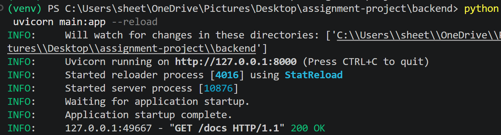
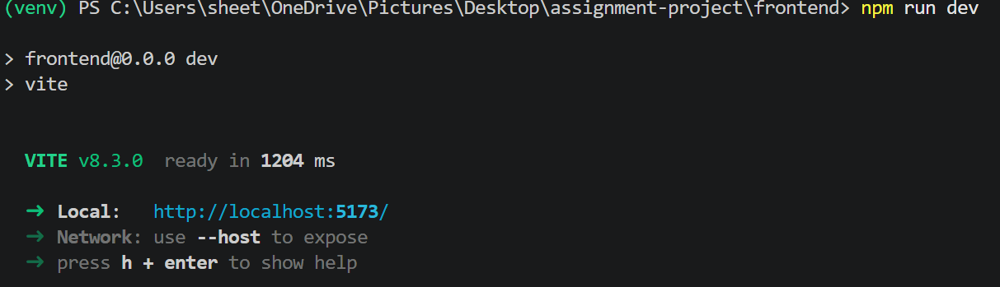
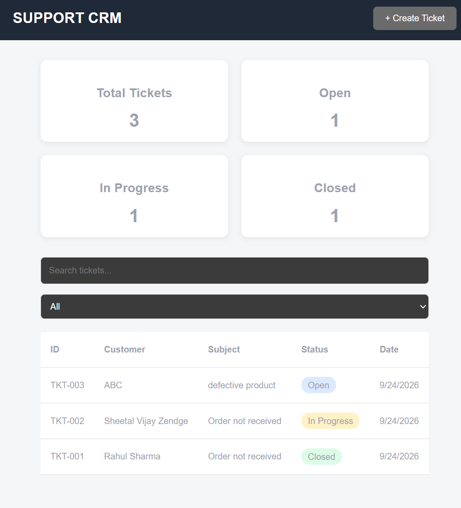

# Customer Support CRM

## Overview

A full-stack customer support ticket management system.

## Features

- Create tickets
- View tickets
- Search tickets
- Filter tickets
- Update ticket status
- Add notes
- Dashboard statistics

## Tech Stack

Frontend:
React

Backend:
FastAPI

Database:
SQLite

## Running Backend



## Running Frontend


## API Endpoints

POST /api/tickets
GET /api/tickets
GET /api/tickets/{ticket_id}
PUT /api/tickets/{ticket_id}

## Deployment

1. Clone the Project

```bash
git clone <your-github-repository-url>
cd assignment-project
```
2. Backend Setup
Open a terminal and run:

```bash
cd backend
```

Create and activate the virtual environment:

```bash
python -m venv venv
```

Windows:

```powershell
venv\Scripts\activate
```

Install the required packages:

```bash
pip install -r requirements.txt
```

Start the FastAPI server:

```bash
python -m uvicorn main:app --reload
```

Backend will run at:

```text
http://127.0.0.1:8000
```

API documentation:

```text
http://127.0.0.1:8000/docs
```
3. Frontend Setup

Open another terminal:

```bash
cd frontend
```

Install dependencies:

```bash
npm install
```

Start the React development server:

```bash
npm run dev
```

Frontend will run at:

```text
http://localhost:5173
```

4. Database

The project uses SQLite for storing ticket information.

The database is created automatically when the backend is initialized.

5. Environment Variables

If environment variables are required, create a `.env` file in the appropriate folder and add the required configuration.

Do not upload sensitive API keys or passwords to GitHub.

6. Deployment

For production deployment:

* **Frontend:** Deploy the React/Vite application using a hosting service such as Vercel or Netlify.
* **Backend:** Deploy the FastAPI application using a service that supports Python applications.
* **Database:** Use SQLite for simple/local deployment or migrate to a production database such as PostgreSQL when required.

Update the frontend API URL to point to the deployed backend URL instead of:

```text
http://127.0.0.1:8000
```

### 7. Local Development

The complete application can be tested locally by running:

**Backend**

```bash
python -m uvicorn main:app --reload
```

**Frontend**

```bash
npm run dev
```

Then open:

```text
http://localhost:5173
```


## Screenshots

.

## Future Improvements

1.User Authentication: Add secure login and role-based access for Admin, Support Staff, and Customers.
2.Email Notifications: Send automatic email notifications when a ticket is created, updated, or resolved.
3.Mobile Application: Develop a mobile application for customers and support staff.